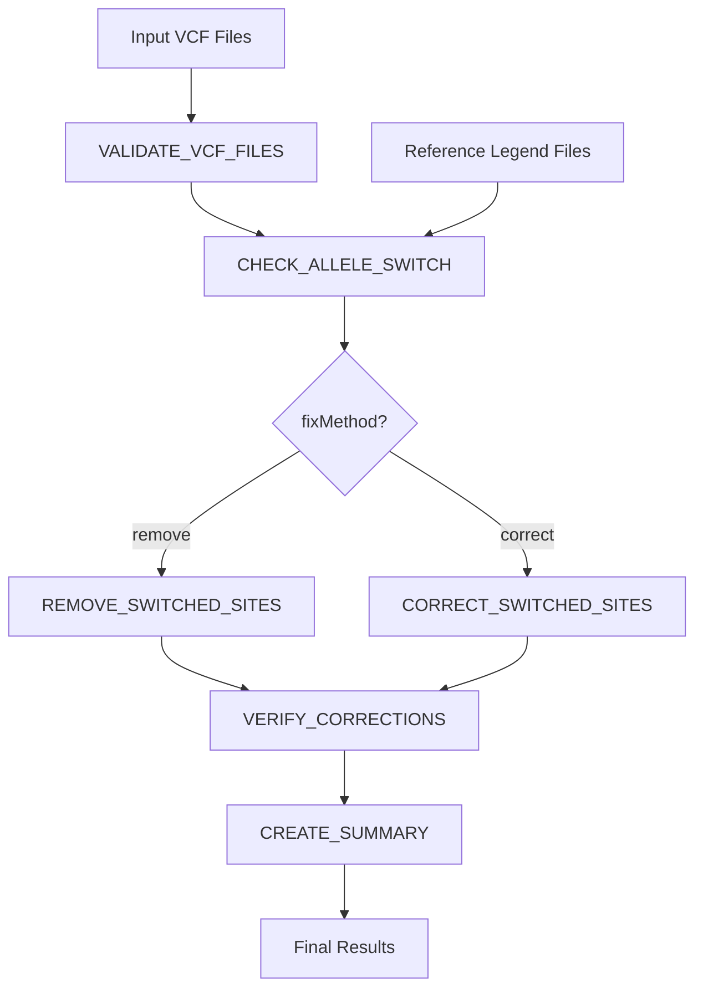

# Workflow Overview

CheckRef performs allele switch detection and correction through a series of automated steps.

## Pipeline Summary

## Process Flow

### 1. Validation
- Check VCF file integrity
- Detect corrupted or empty files
- Verify VCF format compliance

### 2. Chromosome Matching
- Extract chromosome from filename
- Pair VCF with corresponding legend file
- Skip files without matches

### 3. Allele Switch Detection
- Extract common positions
- Compare REF/ALT orientations
- Identify mismatches
- Detect build incompatibilities

### 4. Correction/Removal
**Remove mode**: Exclude switched sites  
**Correct mode**: Swap REF↔ALT alleles

### 5. Verification
- Re-check fixed VCF files
- Confirm all switches resolved
- Report any remaining issues

### 6. Summary Generation
- Aggregate statistics across chromosomes
- Calculate overlap percentages
- Generate final reports

## See Also

- [Process Flow](/workflow/process-flow) - Detailed process descriptions
- [Resource Usage](/workflow/resources) - CPU/memory requirements
- [Modules](/api/modules) - Process reference
